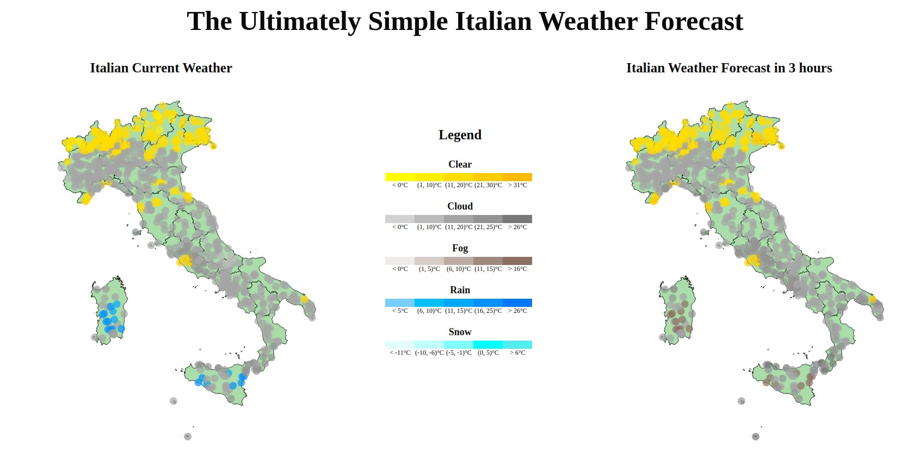

# The Ultimately Simple Italian Weather Forecast


## Index
* [Requirements](#requirements)
* [Prerequisites](#prerequisites)
* [Usage](#usage)
* [Authors](#authors)

## Requirements
This project requires:
* Java 8 SDK
* Python 3
* Scala
* Apache Spark
* Apache Kafka
* Apache Cassandra
* D3.js
* Node.js v14.18.1
* npm v6.14.15

## Prerequisites
This application was tested with Ubuntu 20.04 LTS.
The following environment variable must be set before running the code:  
```bash 
export KAFKA\_HOME="/path/to/the/kafka/folder"  
export CASSANDRA\_HOME="/path/to/the/cassandra/folder"  
```

## Usage
To run the code we can follow two paths.
The first one (simplest):
```bash
./start-server.sh
```
Visit http://localhost:14520

The second one (longest):
```bash
zookeeper-server-start.sh $KAFKA_HOME/config/zookeeper.properties
kafka-server-start.sh $KAFKA_HOME/config/server.properties
kafka-topics.sh --create --zookeeper localhost:2181 --replication-factor 1 --partitions 1 --topic weather
kafka-topics.sh --create --zookeeper localhost:2181 --replication-factor 1 --partitions 1 --topic forecast
cassandra -f
cd producer && sbt run
cd sparkstreaming && sbt run
cd app && npm install && npm start
```
Visit http://localhost:14520

## Authors
* [Davide Marinaro](https://github.com/davsailor)
* [Luca Colasanti](https://github.com/LucaColasanti)
